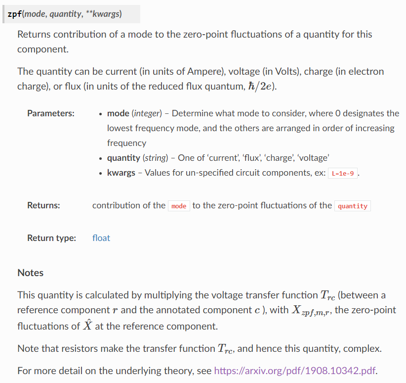

.. _commenting:

=========================
Formatting
=========================

Formatting
----------

Your code should conform to the Black code style.
By using `Black <https://black.readthedocs.io/en/stable/>`_,
the formatting can
be performed automatically at each commit.
To set this up,

``pip install black==19.10b0 pre-commit``

or

``pip install -r requirements-dev.txt``

then navigate to the root of the repository and run

``pre-commit install``

Now each time you commit, your code will automatically be formatted in the correct way.
To check if the formatting is correct, you can always run

``black --check src/``

Aternatively, one can run the Black formatter manually
on all source files before each commit

``black src/``

Comments
--------

Commenting your code should come in two flavors.

First are inline comments which explain what the code is doing, for example

.. literalinclude:: example_inline_comment.txt
   :language: pyth

the more of these, the better!

The second, and most important comments are docstrings.
These should describe *at least* what every function or class does, what parameters it accepts and what it returns,
and *ideally* feature examples of typical use or some theoretical background.

This accomplishes two things:

-  The docstring can automatically be transformed to content for the QuCAT website
- It will appear to a user who requests help on a function (for example by using shift-tab in a jupyter notebook)

Docstrings should be formatted as `numpy style docstrings <https://numpydoc.readthedocs.io/en/latest/format.html#id4>`_.
As an example, this docstring

.. literalinclude:: example_docstring.txt
   :language: python

Translates to the following website content

